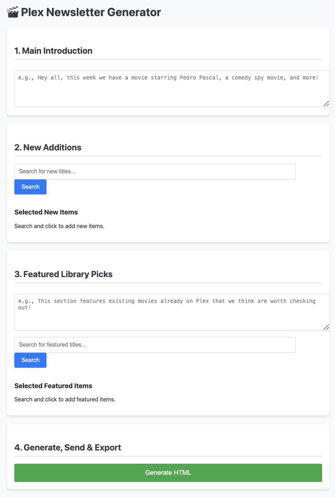
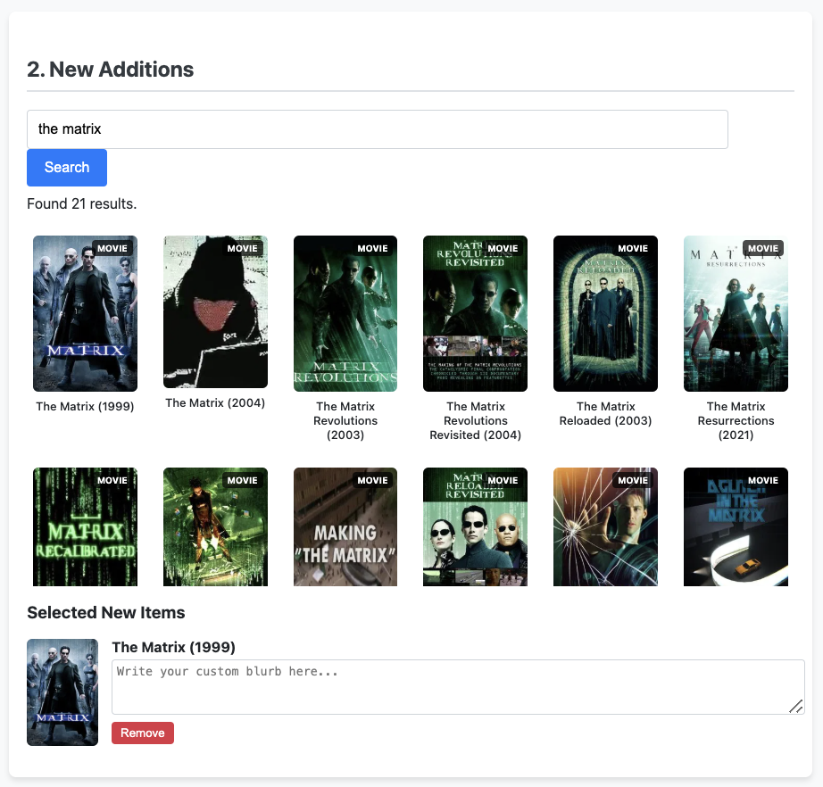
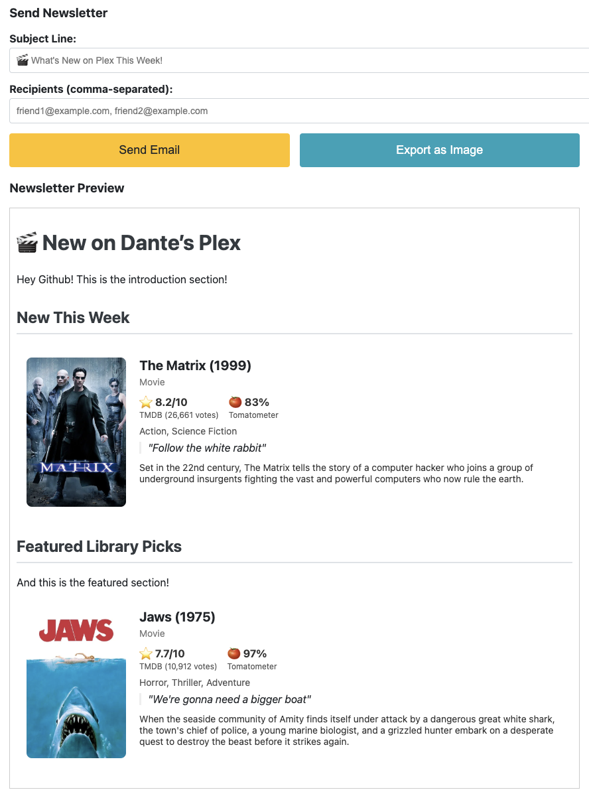
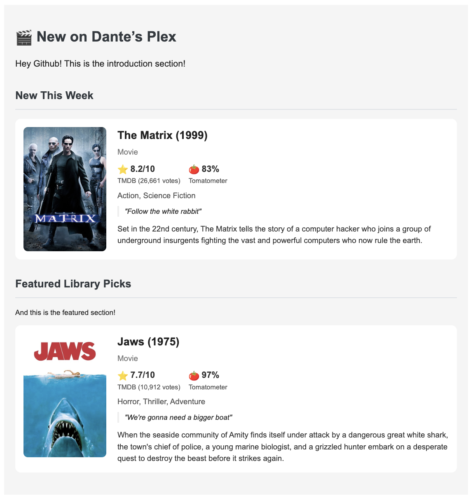

# 🎬 Plex Newsletter Generator

A Flask web application that generates beautiful HTML newsletters for your Plex media server, featuring new additions and curated library picks with movie/TV show details from TMDB and Rotten Tomatoes ratings.

## Features

- **Search Integration**: Search movies and TV shows using The Movie Database (TMDB) API
- **Rich Media Details**: Automatic fetching of ratings, genres, overviews, and poster images
- **Rotten Tomatoes Scores**: Integration with OMDb API for critic ratings
- **Custom Blurbs**: Add personalized descriptions for each title
- **Email-Ready HTML**: Generates newsletter HTML optimized for email clients
- **Direct Email Sending**: Send newsletters directly through Gmail SMTP
- **Image Export**: Export newsletters as PNG images
- **Responsive Design**: Clean, modern interface that works on all devices

## Screenshots

### Main Interface

*The main page showing the search interface and selected items*

### Search Results

*Search results showing movies and TV shows with details from TMDB*

### Email Sending Interface

*The email sending form with recipient fields*

### Final Newsletter

*The generated newsletter as it appears in email clients*

## Prerequisites

- Python 3.7+
- Gmail account with App Password enabled
- TMDB API key (free at [themoviedb.org](https://www.themoviedb.org/settings/api))
- OMDb API key (free at [omdbapi.com](http://www.omdbapi.com/apikey.aspx))

## Installation

1. **Clone or download the project**
   ```bash
   git clone <repository-url>
   cd newsletter
   ```

2. **Install dependencies**
   ```bash
   pip install flask requests python-dotenv premailer
   ```

3. **Set up environment variables**
   
   Create a `.env` file in the project root:
   ```env
   GMAIL_USER="your_email@gmail.com"
   GMAIL_PASSWORD="your_16_digit_app_password"
   TMDB_API_KEY="your_tmdb_api_key"
   OMDB_API_KEY="your_omdb_api_key"
   PLEX_OWNER_NAME="Your Name"
   ```

4. **Gmail App Password Setup**
   - Enable 2-factor authentication on your Google account
   - Generate an App Password: Google Account → Security → App passwords
   - Use the 16-digit app password (not your regular Gmail password)

## Usage

1. **Start the application**
   ```bash
   python app.py
   ```

2. **Open your browser**
   
   Navigate to `http://localhost:5000`

3. **Create your newsletter**
   - Write an introduction in the main text area
   - Search for new additions and click to add them
   - Add custom blurbs for each title
   - Search for featured library picks
   - Write an introduction for the featured section

4. **Generate and send**
   - Click "Generate HTML" to create the newsletter
   - Preview the result
   - Add recipients and subject line
   - Send via email or export as image

## API Keys Setup

### TMDB API Key
1. Create account at [themoviedb.org](https://www.themoviedb.org/)
2. Go to Settings → API
3. Request an API key (free)
4. Copy the API key to your `.env` file

### OMDb API Key
1. Visit [omdbapi.com](http://www.omdbapi.com/apikey.aspx)
2. Request a free API key
3. Check your email for the key
4. Add it to your `.env` file

## Project Structure

```
newsletter/
├── app.py              # Main Flask application
├── templates/
│   └── index.html      # Web interface
├── .env               # Environment variables (create this)
├── .gitignore         # Git ignore file
└── README.md          # This file
```

## Features in Detail

### Newsletter Sections
- **Introduction**: Custom welcome message
- **New This Week**: Recently added titles to your Plex server
- **Featured Library Picks**: Curated recommendations from existing library

### Movie/TV Show Information
- High-quality poster images
- TMDB ratings with vote counts
- Rotten Tomatoes critic scores (when available)
- Genre information
- Plot overviews
- Custom blurbs for personal recommendations

### Email Compatibility
- HTML optimized for email clients
- Inline CSS for maximum compatibility
- Table-based layout for older email clients
- Fallback text for non-HTML email clients

## Troubleshooting

### Common Issues

**"Email credentials not configured"**
- Verify your `.env` file has correct Gmail credentials
- Ensure you're using an App Password, not your regular password
- Check that 2FA is enabled on your Google account

**"API key errors"**
- Verify your TMDB and OMDb API keys are correct
- Check that your API keys haven't exceeded rate limits
- Ensure the `.env` file is in the project root directory

**"No search results"**
- Check your internet connection
- Verify API keys are working
- Try different search terms

4. **Commit them** to the repository - screenshots should be included in version control for documentation

## Contributing

Feel free to submit issues, feature requests, or pull requests to improve the newsletter generator!

## License

This project is open source and available under the MIT License.